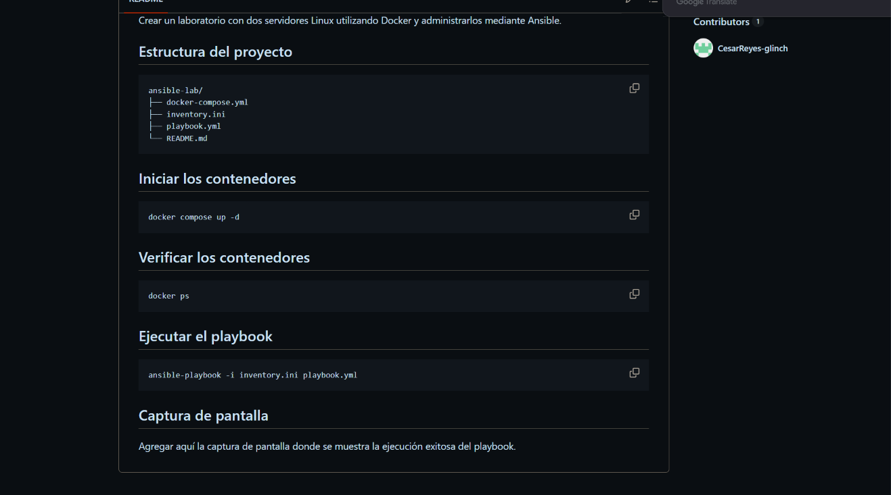

# Laboratorio Ansible con Docker

## Objetivo

Crear un laboratorio con dos servidores Linux utilizando Docker y administrarlos mediante Ansible.

## Estructura del proyecto

```
ansible-lab/
├── docker-compose.yml
├── inventory.ini
├── playbook.yml
└── README.md
```

## Iniciar los contenedores

```bash
docker compose up -d
```

## Verificar los contenedores

```bash
docker ps
```

## Ejecutar el playbook

```bash
ansible-playbook -i inventory.ini playbook.yml
```

## Captura de pantalla


